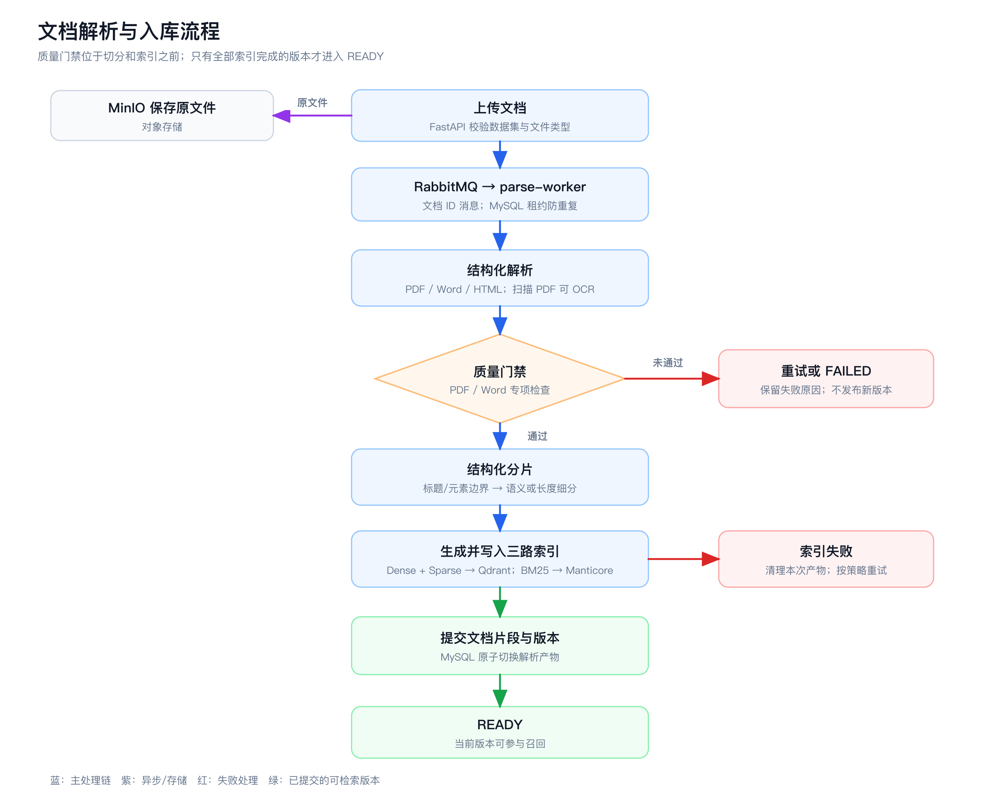
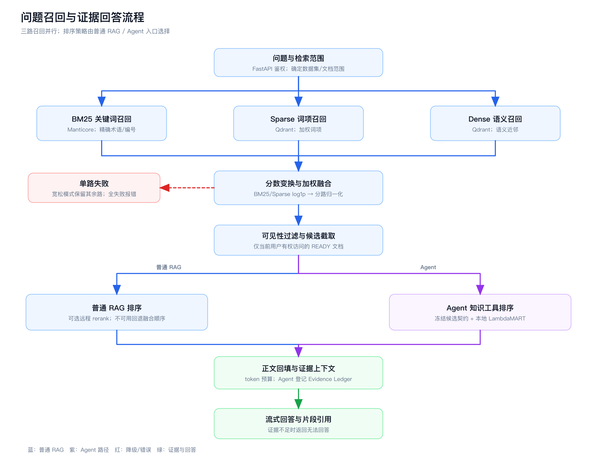

# 能碳会计 AI 智能体与报告生成技术交底书

## 一、技术领域与拟解决的问题

本方案面向企业能耗、碳排放及其核算依据的文档问答与业务报告生成。资料可能以 PDF、Word、HTML 等形式进入知识库，包含跨页表格、指标数值、单位、公式、图表和版本差异。仅按关键词检索容易漏掉语义相近但措辞不同的依据；仅按语义向量检索又可能把编号、年份、单位或条件相近但并不相同的段落排到前面。若解析阶段漏页、乱序或错误切断表格，即使后续检索算法正常，也无法给出可追溯的回答。

本项目以证据可追溯为核心，把“入库质量门禁—结构化分片—三路混合召回—证据约束生成”连成一条可检查的数据链，并在其上接入 Pi Agent 的受控工具编排、指定文档阅读和异步报告生成。其目标是让问答和报告中的事实能够回到有权限的文档版本或任务冻结的来源材料及具体片段；检索单路故障时明确降级，强制排序或报告门禁失败时阻止无依据的产出。当前代码实现了这些工程机制；能碳领域的端到端准确率尚需建立人工金标后测量。

## 二、系统架构与三条业务链

```text
PDF / DOC(X) / HTML
       │ 上传、鉴权与数据集归属校验
       ▼
FastAPI ──原文件──► MinIO
   │ 文档 ID 消息
   ▼
RabbitMQ ──► parse-worker ──► 解析与质量门禁 ──► 结构化分片
                                             ├─► MySQL：文档状态、版本、片段正文与来源
                                             ├─► Qdrant：Dense / Sparse 向量
                                             └─► Manticore：BM25 全文索引

用户问题 ──► FastAPI ──► 三路并行召回 ──► 分数归一化与融合
                                      ──► READY/权限/版本过滤 ──► 正文回填
                                      ──► 可选重排与上下文组装 ──► LLM 流式回答及引用

智能体问题 ──► FastAPI（鉴权、运行范围） ──► 独立 Pi Agent
                    ▲                           │ 受控知识工具调用
                    └──── 内部工具回调 ◄───────────┘
                       三路召回 / 证据扩展 / 章节阅读 ──► 证据台账 ──► 引用回答

报告请求 ──► FastAPI（冻结来源、模板、模型） ──► RabbitMQ ──► report-worker
                                                      └─► Pi report-agent ──► ReportIR ──► 预览与导出
```

FastAPI 管理身份、数据集范围、模型配置和对外接口；MySQL 是文档状态、版本及片段的事实源；MinIO 保存原件和解析后的 Markdown/图片；Qdrant 在同一 collection 使用 `dense`、`sparse_text` 两种 named vector；Manticore 提供按数据集隔离的 BM25 索引。独立 `parse-worker` 消费 RabbitMQ 持久消息，消息只携带文档 ID，MySQL 租约和心跳用于防止多个 worker 重复提交。解析、索引与召回源码位于本仓库 `app/rag`，不是运行时转发到另一个 LinkRag 服务。依据：[README](../README.md)、[入库编排](../app/services/document_ingestion.py)、[解析 worker](../app/workers/document_parse_worker.py)。

上述架构形成三条相互衔接的业务链：文档入库链负责解析、门禁和索引；知识问答链负责三路召回、证据阅读及流式回答；报告链在冻结来源后由独立 worker 异步生成结构化产物。三条链共用文档版本、访问控制和证据来源，但问答的即时片段上下文与报告的全文覆盖校验具有不同的执行约束。

## 三、文档入库的具体实施方式



图 1：文档解析与入库流程（[SVG 原图](figures/rag-parse-flow.svg)）。PDF/Word 专项质检未通过时不进入分片和索引；HTML 无同一套专项门禁，仍须完成后续索引和状态提交。

### 解析与质量门禁

上传后，文档从 `QUEUED` 经 worker 领取为 `PROCESSING`。PDF 由 OpenDataLoader 结构解析；扫描页优先按默认 280 DPI 使用本地 RapidOCR，低置信可由数据集绑定的 Vision 模型补充。Word 先将表格转换成统一结构：简单表格输出 GFM Markdown，复杂表格保留跨行、跨列及嵌套关系的 `table-rag-v2` 文字结构；公式转换为 LaTeX。解析产物进入质量门禁，未达要求不应建立可供用户召回的 READY 文档。依据：[README §文档解析](../README.md)、[入库编排](../app/services/document_ingestion.py)。

### 结构化分片与索引提交

通过门禁后，分片器接收解析器输出的结构化元素及其原文位置，而不是把整篇 Markdown 按固定字符数截断。第一阶段 `candidate_boundary` 顺着标题层级、章节和条款边界构造候选块：遇到强章节边界会优先分开；一般标题或条款需兼顾候选块的 token 软下限，避免只剩一个标题或过短正文。标题路径会随块保存，使后续检索结果仍能说明该内容属于哪一章、哪一节。

第二阶段负责处理候选块内部的长度与语义边界。当前代码和示例环境配置默认使用 `semantic_depth_window`：不超过默认 512 token 目标长度的候选块直接保留；较长的块会拆成文本或受保护元素组成的小单元，比较相邻窗口的 embedding 语义凝聚程度，优先在语义下降且结构允许的位置切开。若语义评分失败，则退回确定性的长度打包；也可显式选择 `noop`，它保留短块，对超长块仍按段落、行、句子和 token 边界做长度兜底，并非完全不处理。默认候选块软下限为 128 token、目标上限为 512 token、最终硬上限为 1024 token，数据集配置可覆盖这些值。

表格、图片、代码和公式在切分时作为受保护元素处理，通常不会从内部随意切开；但单个元素超过硬上限时，仍可能按安全边界截断并记录诊断标记，不能承诺任何长度下都完整保留。表格和图片还可各自形成便于检索的派生片段：主体片段保留其位置或引用，派生片段保存结构化表格文字或图片说明、标题路径及必要的相邻语境，并通过 `source_chunk_index` 指回主体片段。这使一张表既能被整章语境定位，也能凭表内内容单独命中。

最终分片输出后，普通片段可从前后相邻片段各取最多默认 64 token 的上下文，帮助跨边界的句子和指代被检索到；补入量受 1024 token 硬上限约束，派生片段、文档前置元信息及默认含受保护元素的片段不参与这一步。相邻上下文只是检索用的重复文本，不改变原文分片边界。输出记录连续的 `chunk_index`、原文行范围、标题路径、元素类型、切分策略及主体/派生关系；入库时再绑定稳定 `chunk_id`、文档和版本，用于索引、来源展示与定位。分片结果在写入索引前还要通过覆盖、顺序、派生锚点和长度等校验。

同一批片段分别生成 Dense 与 Sparse 表示，并写入 Qdrant；中文分词后的 BM25 索引写入 Manticore。仅在片段真值集及三路索引写入成功后，服务才把文档设为 `READY` 并切换当前解析产物。重新解析采用新版本和独立产物路径；租约失效、失败或退避重试耗尽不会把不完整的新产物冒充旧版本。检索只使用有权限且状态为 `READY` 的文档。依据：[入库编排](../app/services/document_ingestion.py)、[召回可见性门禁](../app/rag/core/pipeline/recall/pipeline.py)。

## 四、三路召回与普通 RAG 问答



图 2：问题召回与证据回答流程（[SVG 原图](figures/rag-recall-flow.svg)）。普通 RAG 和 Agent 共用受控的三路召回，但后续排序策略及 Agent 的证据登记方式不同。

### 三路检索与分数融合

系统默认开启 BM25、Sparse、Dense 三路。默认各路候选深度分别为 100、50、100，融合候选窗口为 64；这些值可由数据集配置覆盖。BM25 偏向精确术语、编号和单位，Sparse 保留词项权重，Dense 捕获改写和语义近邻。各路检索可并行执行；默认宽松模式允许单路故障降级，但全部失败会报错。召回结果先按片段 ID 合并，BM25/Sparse 原始分做 `log1p`，Dense 分数直接使用，再分别在各路内部做 min-max 归一化。默认权重 BM25 0.15、Sparse 0.15、Dense 0.70；某一路没有命中时，仅在实际有命中的路之间重新分配权重，一个片段没有命中的路贡献为零。随后先过滤无权访问或非 READY 的文档，再截取结果。依据：[配置](../app/rag/config.py)、[融合实现](../app/rag/core/pipeline/recall/fusion.py)、[召回管线](../app/rag/core/pipeline/recall/pipeline.py)。

### 排序与引用回答

普通 RAG 流接口在融合结果上回填片段正文；若数据集启用并配置了远程 rerank，可继续精排，否则按融合顺序降级。`RECALL_LTR_MODE` 默认 `off`，因此不能把 LambdaMART 的历史评测成绩称作普通 RAG 当前默认成绩。该模式另支持 `shadow`、`active` 和 `baseline`：旁路对比、主链本地排序、主动回滚分别有独立语义。依据：[RAG 流实现](../app/rag/application/recall_stream_runtime.py)、[LTR 装配](../app/rag/application/ltr_provider.py)、[Agent 设计](pi-agent.md)。

生成阶段把入选片段拼入有 token 预算的上下文，要求模型只依据给定证据作答，并在事实句后标注 `[片段N]`。证据内容被视为待分析资料，不作为改变模型规则的指令；无可用上下文时返回固定的无法回答说明，不调用对话模型。SSE 提供召回完成、回答增量和终态事件。依据：[生成提示词](../app/rag/core/prompts/rag_generation.py)、[RAG 接口](../app/api/rag.py)、[Agent 设计](pi-agent.md)。

## 五、Pi Agent 与受控知识问答

### 服务边界与工具权限

前端保留普通 RAG 与智能体两种对话模式，分别调用 `/api/v1/rag/stream` 和 `/api/v1/agent/stream`。智能体模式由 FastAPI 完成用户鉴权、知识库归属校验、模型配置解析和运行登记，再调用独立的 Node 22 Pi 服务执行 Agent loop；Pi 使用项目固定版本的运行时，复用现有 `CHAT` 模型配置。Pi 与 FastAPI 通过服务令牌及内部回调令牌双向通信。Pi 不直接连接 MySQL、MinIO、Qdrant、Manticore 或 RabbitMQ，也不开放通用命令执行和文件编辑工具；知识库、文档和检索参数始终由 FastAPI 按本次运行的 `run_id` 控制。

### 问题路由、证据登记与逐级阅读

每轮智能体先加载知识库检索、问题路由、证据作答和文档阅读四项工作流规则。寒暄等非知识请求可以不召回；涉及企业资料、政策、标准或核算依据的问题必须调用 `hybrid_recall`。知识工具还包括 `get_retrieval_scope`、`expand_evidence`、`get_document_outline` 和 `read_document_section`。未指定知识库时使用当前用户有权访问的全部 `ACTIVE` 知识库，明确选择后只在所选子集内检索；跨库使用统一召回策略，单库使用该库配置。Pi 只能看到本轮不透明的知识库和文档引用，不能自行扩大范围或改写三路权重、候选深度。`hybrid_recall` 走冻结的候选契约和本地 LambdaMART 排序；候选命中与真正注入模型上下文的片段分开记录。

FastAPI 为每次运行维护 Evidence Ledger：重复命中复用证据 ID，只有进入上下文的片段获得稳定的 `[片段N]` 引用。片段被截断、表格或公式缺少上下文时，智能体可用已登记证据向同文档同版本的前后各最多三个片段扩展；需要整篇总结、跨章节比较或阅读指定章节时，先获取文档目录，再按游标分页读取章节，每页最多八个片段。新读到的正文也进入证据台账；分页尚未读完时不能声称已通读全文。SSE 的 `recall_done` 事件除候选与失败路数外，还携带实际知识库范围、各路权重与耗时、跨库命中分布、证据 ID 及是否入选上下文，便于解释回答依据。

### 指定文档与直传材料问答

对话中可以 `@` 一份已处于 `READY` 状态的知识库文档；本轮提问时，FastAPI 将检索范围收窄到该文档，智能体还可按目录和章节工具继续阅读。直传材料由服务端提取文本并返回 `material_id`，可用于对话问答，但不建立知识库文档或三路索引，不进入普通召回。知识库文档引用只在本轮生效；对话及轮次由服务端记录，报告任务可关联到对应轮次。

## 六、异步报告生成与交付

### 报告入口、来源和模板

用户可从文档页创建报告，也可在智能体对话中指定来源并提出生成请求。对话入口先判定本轮是问答还是报告，再识别来源材料和版式模板的角色；多份来源不静默丢弃，报告类型不明确时返回选择交互。来源为 `DOCUMENT` 时，只接受当前用户有权访问的 `READY` 文档，并冻结该文档版本；来源为 `INLINE` 时，对话直传材料仅暂存在服务端，用 `material_id` 建立任务，不入知识库索引。直传来源在任务内部形成专用冻结分片，仍参与报告全文覆盖校验。用户版式模板可以取自已入库文档或直传文件，但只能影响章节标题、顺序、表达和版式，不能改写模板定义中的业务字段、计算公式与证据规则。

系统注册 R1–R7 七类报告模板，分别覆盖产品碳足迹、组织温室气体清单、ESG/可持续性、能源审计、CBAM、SBTi 目标核定和核查声明。模板定义、类型专属 Skill、字段约束与版本共同决定报告结构。当前注册表中的模板状态为 `DRAFT`；类型名称表示可执行的生成方案，不表示已完成第三方审核或认证。

### 冻结任务与异步执行

创建报告时，FastAPI 校验来源、模板、具备工具调用能力的 `CHAT` 模型和模型端点，冻结来源版本、分片清单哈希、模板版本、模型快照与用户指令，生成 `report_run`。创建前和 worker 执行前均按文档及模板规模检查模型上下文预算，超限返回 `REPORT_DOCUMENT_TOO_LARGE`，避免读不完却声称完成。任务写入 MySQL 后，通过可补偿的 outbox 投递 RabbitMQ；独立 `report-worker` 以租约、心跳和重试机制领取任务，并在执行前核对冻结分片、模板和模型快照。执行时为 Pi report-agent 签发绑定当前任务与租约的短时运行令牌。任务由 `PENDING` 进入 `PROCESSING`，可因缺失信息转为 `NEEDS_INPUT` 并在用户作答后继续；成功、失败、取消和来源版本失效分别记录为可查询的终态。

### Pi report-agent 的证据和字段处理

报告 Agent 首先加载公共报告 Skill 与冻结类型的专属 Skill，读取分析上下文、用户补充答案和模板定义，再按稳定游标顺序读完来源分片；有用户版式模板时也须读完对应分片。参考知识可通过受控检索工具获取，但必须区分来源文档、用户输入、参考知识与计算结果。每条报告事实记录在 Evidence Ledger，每个模板字段在 Field Ledger 中标出已取得、已计算、用户补充或缺失等状态，缺失值不能填零。公式经 `calculate_report_metrics` 执行注册计算，保留公式版本、输入、单位和参数证据；阻塞字段缺失或冲突时，任务进入 `NEEDS_INPUT`，向用户提出结构化问题，作答后继续运行。

### ReportIR 校验、产物与可恢复性

Agent 先将完整 ReportIR 草稿落库，再由服务端校验；修复时可按证据、字段或章节条目增量更新草稿，校验通过后才提交。校验包括 JSON Schema、模板字段覆盖、引用关联、证据摘录是否来自冻结分片、用户答案哈希、计算记录以及全部来源分片的覆盖清单；任何未满足的发布门禁都会阻止提交。ReportIR 是在线预览和导出的共同真值，Markdown、DOCX 与 HTML 从该结构分别渲染，渲染阶段不重新调用模型。报告中心按当前用户汇总任务状态、来源和产物，支持查询、取消、失败后重试、补充问题作答与下载；报告结果与原对话轮次关联，便于回到具体任务继续处理。

## 七、质量控制与指标口径

本项目将解析、检索、问答和报告四层质量分别记录。**解析门禁**判断一份输入能否进入索引，**检索评测**判断相关依据能否进入前列，**答案评测**判断结论是否被引用片段支持，**报告校验**判断全文覆盖、字段、证据和计算是否满足提交条件。各层通过情况不能互相替代。

| 层次 | 当前实现或目标 | 证据状态 |
| --- | --- | --- |
| PDF 自动门禁 | 页数/页序、正文与图片覆盖、OCR 置信度、正文 source recall 与 output precision；可靠文本层两项默认下限均为 97% | 已实现的入库门槛，属于结构与文本保真检查，不等于能碳问答准确率 |
| PDF 人工金标 | 页数、页序、扫描页 OCR 覆盖、正文字符准确率、关键数值/单位/公式、简单/复杂/跨页表格、图表关系、引用与 Top 5 噪声等 13 项；缺金标记 `NOT_EVALUABLE` | 评估器及目标阈值已实现；本稿未取得当前业务金标跑分 |
| 检索质量 | `Recall@K` 看全部相关依据的覆盖；`Hit@K` 看至少一条相关依据是否进入前 K；MRR 看第一条相关依据排名；nDCG@K 同时考虑相关性与位置 | 可由 LinkRag-Eval 历史报告说明方法；需用能碳语料重新测量 |
| 生成质量 | 事实可支持率、引用准确率、拒答正确率，以及数值、单位、版本和适用条件错误率 | 建议的业务验收项；当前没有可引用的统一实测值 |
| 报告发布门禁 | 冻结来源分片须全部覆盖（100%），并校验 ReportIR 结构、字段台账、证据摘录与引用、注册计算及阻塞字段状态 | 服务端已实施的提交校验；模板为 DRAFT，尚无可引用的业务报告准确率或审核通过率 |
| 报告业务评测 | 字段准确率、证据支持率、公式复算一致率、缺失项识别率、文档覆盖率及导出一致率 | 建议按 R1–R7 类型分别建立人工金标并测量，不以结构校验通过率代替业务正确率 |

PDF 金标策略中，页数/页序/扫描页 OCR 覆盖目标为 100%，正文字符准确率不低于 97%，关键 token、公式、简单表格、跨页表格、图表结构及引用均要求精确，复杂表格单元格准确率不低于 98%，未说明图片片段数和 Top 5 噪声数为零。这些是 `PdfAcceptancePolicy` 的验收阈值，**不是已取得的成绩**；Vision 图表语义、字符和公式准确率仍需人工金标验证。依据：[PDF 评估器](../app/rag/evaluation/pdf_acceptance.py)、[README §PDF 金标验收](../README.md)。

LinkRag-Eval 提供了算法来源侧的历史质检信息，可用于解释为何选择多路检索，也可作为后续同口径复测的参照，但与本仓库现行数据、索引后端和参数不完全相同：

| 历史实验 | 数据和配置 | 主要结果 | 适用边界 |
| --- | --- | --- | --- |
| 两路与三路对照，2026-06-20 | 四领域 500 题，BM25+Sparse 对比加 Dense，RRF 融合、每路 Top 20 | Recall@10：0.851→0.932；Hit@10：0.902→0.956；MRR：0.824→0.880 | 说明当时增加 Dense 的增益；不是当前 weighted-score/Manticore 链路的成绩 |
| 三种路由对照，2026-07-05 | 四领域 394 个 doc 粒度查询、3200 chunk，weighted score、Top 10；当时 BM25 走 Qdrant sparse | Dense / Dense+BM25 / 三路 Recall@10 分别为 0.9745 / 0.9750 / 0.9725；三路 MRR 0.9216 | 增路未必提高 Top 10 查全；旧实验权重和索引与本项目默认配置不同 |
| Blind v5 排序验收，2026-07-28 | 750 题，比较旧 weighted score 与 LambdaMART v3+短词回退 | Hit@10：98.80%→99.07%；MRR：92.16%→95.64%；真实搜索子集 MRR 下降 0.70 个百分点 | Hit@10 增益不显著（McNemar p=0.5）；当时建议先 Shadow，不是本项目上线证明 |

历史报告原文：[两路/三路](</Users/jixu/Project/Agent/LinkRag-Eval/docs/reports/recall_routes_2way_vs_3way.md>)、[三种路由](</Users/jixu/Project/Agent/LinkRag-Eval/docs/reports/multi_route_recall_comparison_2026_07_05.md>)、[Blind v5](</Users/jixu/Project/Agent/LinkRag-Eval/docs/reports/blind_v5_production_contract_acceptance_2026_07_28.md>)。报告中的实验参数、标签口径、数据集与发布状态应随任何对外引用一并保留。

本项目采用的 BM25、Sparse、Dense 三路召回技术，在配套 LinkRag-Eval 的 500 题质检中展现出明显的多路互补效果：加入 Dense 后，Recall@10 从 85.1% 提升至 93.2%（+8.1 个百分点），Hit@10 从 90.2% 提升至 95.6%（+5.4 个百分点），MRR 从 82.4% 提升至 88.0%。这一对照结果定量说明语义召回能够补足关键词和稀疏检索的漏召回；当前能碳项目也已将三路索引与融合、文档权限和 READY 状态过滤、单路故障降级接入服务链路。该质检使用四领域语料和 RRF 融合，当前服务配置使用加权分数融合。

报告质量的工程门禁与离线召回质检口径不同。任务只有在冻结来源完整读取、字段与证据关系有效且 ReportIR 可发布时才形成最终产物；报告中的数值正确性、专业判断及适用条件仍应按具体报告类型进行人工验收。

## 八、可交底的技术要点与后续验证

可供进一步讨论的实施要点是：在文档版本与解析质量约束下建立同一稳定片段 ID 的三种索引；在融合前做分路分数变换与归一化，在融合后再执行权限和 READY 过滤；将排序候选与真正送入生成上下文的证据分开，并以稳定编号约束答案引用；在解析失败、单路故障、重排不可用或资料不足时采取有记录的回退行为。报告侧还通过冻结任务快照、全文覆盖清单、Evidence Ledger、Field Ledger 与 ReportIR 提交校验形成可追溯产物。这些是当前代码可见的实现组合，是否具备专利新颖性和创造性尚未检索或判断。

下一版应补充一套经人工标注的能碳业务金标：按政策/核算标准、排放因子、企业报告、表格数值、跨页引用、版本冲突和拒答场景分层，记录原文版本、问题、相关片段 ID、可接受答案及判定人。以冻结的语料、模型、配置与代码提交运行解析验收、Recall/Hit/MRR/nDCG 和答案支持性评估，并附运行日期、失败路数、样本量和置信区间。没有这些材料之前，本文只能交代系统方案与历史参考指标，不能声称“当前能碳 RAG 达到某个检索或问答准确率”。
